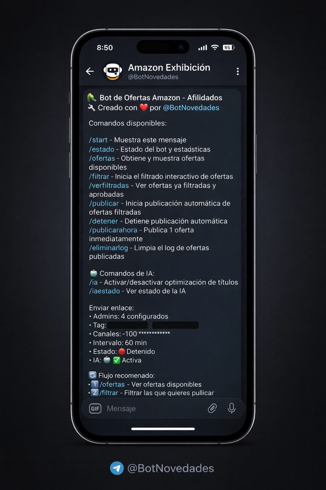
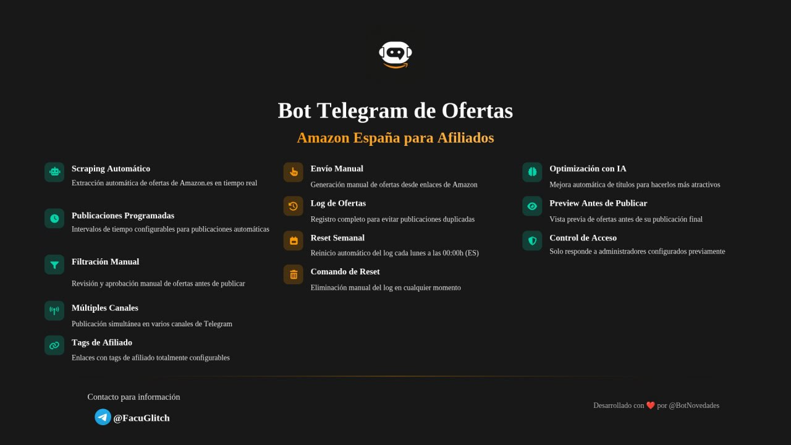

# 🤖 Amazon Deals Bot para Telegram

Automatiza la publicación de las **mejores ofertas de Amazon.es** directamente en tus canales de Telegram.
Este bot está diseñado para **maximizar tus ganancias con afiliación** y ahorrarte horas de trabajo manual, combinando **scraping automático** con **optimización mediante IA**.

---

## 📸 Vista General





> 💡 *Las imágenes muestran el panel de comandos del bot en Telegram y un resumen visual de sus funcionalidades principales.*

---

## ✨ Características Principales

### ▫️ 🕐 Scraping y Publicación Automática
Busca y comparte ofertas de Amazon.es en los **intervalos que definas**. Configuralo una vez y dejá que trabaje solo.

### ▫️ 🤔 Filtrado Inteligente
Antes de publicar, podés **revisar y aprobar manualmente** solo las ofertas que te interesan. Vos tenés el control final.

### ▫️ 📢 Multi-canal
Publicá simultáneamente en **múltiples canales de Telegram** desde una sola instancia del bot.

### ▫️ 💰 Afiliación sin Complicaciones
Inserta automáticamente tu **tag de afiliado de Amazon** en todos los enlaces.

### ▫️ 🛠 Control Total Manual
¿Encontraste una buena oferta? Creala y enviala **al instante** desde cualquier enlace de Amazon.

### ▫️ 🧠 Títulos Optimizados con IA
Optimización automática de títulos para que sean **más atractivos, claros y con mayor CTR**.

### ▫️ 👀 Vista Previa Antes de Publicar
Visualizá exactamente cómo se verá la oferta en Telegram **antes de enviarla**.

### ▫️ 📋 Gestión Inteligente de Logs
Sistema de registro que **evita publicaciones duplicadas** y mantiene un historial de ofertas.

### ▫️ 🔄 Reinicio Automático Semanal
El log se limpia automáticamente **cada lunes a las 00:00h (hora España)**.

### ▫️ 🧹 Comando de Reset Manual
Posibilidad de **limpiar el log manualmente** en cualquier momento.

### ▫️ 🔐 Acceso Restringido
El bot solo responde a **administradores autorizados**, garantizando seguridad y control.

---

## 🧩 Comandos Principales

```text
/start            → Muestra el panel principal
/estado           → Estado del bot y estadísticas
/ofertas          → Ver ofertas disponibles
/filtrar          → Filtrado interactivo de ofertas
/verfiltradas     → Ver ofertas aprobadas
/publicar         → Inicia publicación automática
/detener          → Detiene la publicación automática
/publicarahora    → Publica una oferta inmediatamente
/eliminarlog      → Limpia el log de ofertas

/ia               → Activar / desactivar optimización con IA
/iaestado         → Ver estado de la IA
```

---

## 🚀 Flujo Recomendado de Uso

1️⃣ `/ofertas` → Revisar ofertas disponibles  
2️⃣ `/filtrar` → Aprobar solo las que quieras publicar  
3️⃣ `/publicar` → Automatizar publicaciones en tus canales

---

## 📞 Contacto, Contratar y Soporte

¿Tienes dudas, sugerencias o necesitas ayuda? ¡Hablemos!

- **Telegram:** [@FacuGlitch](https://t.me/FacuGlitch)

---

## ❤️ Créditos

Desarrollado con amor y esmero por **[@BotNovedades](https://t.me/BotNovedades)**.
